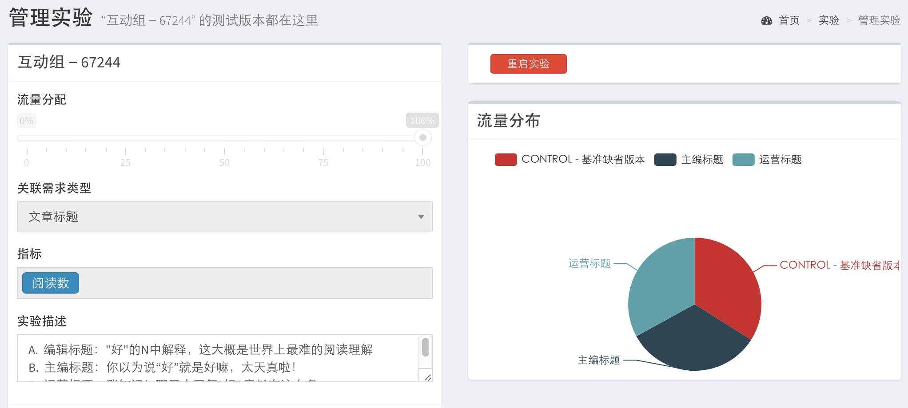
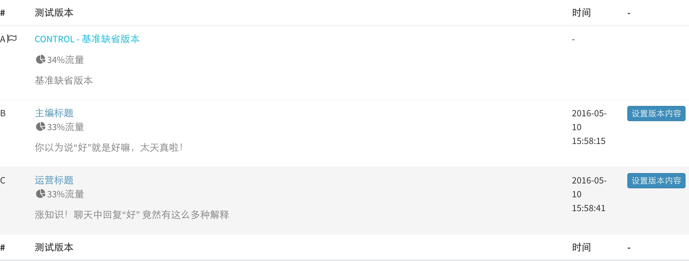
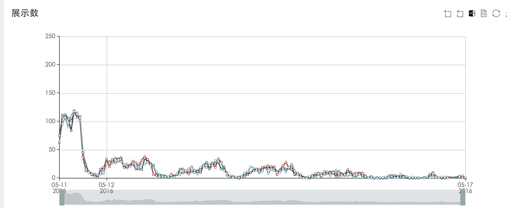
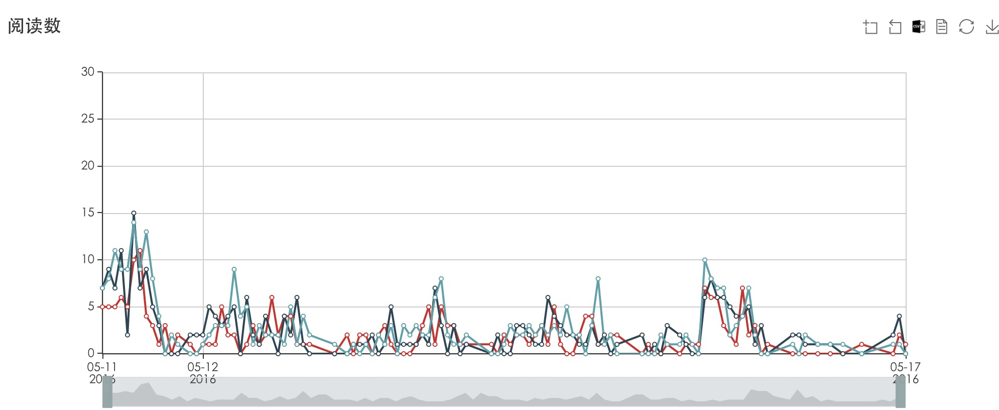

# 橘子A/B Test
这是橘子娱乐研发的一套用于橘子娱乐APP的A/B testing系统。

本文档使用gitbook发布，==> [文档地址](https://happyjuzi.gitbooks.io/doc-abtest/content/)

## 介绍

系统分为以下部分

| 模块 | 技术 | 介绍 | 文档 |
| -- | -- | -- | -- |
| 在线存储系统 | 1:2 ||[文档](storage/index.md)|
| 后台管理系统 | 使用ThinkPHP、AdminLTE、 ECharts||[文档](cms/index.md)|
| 流量策略系统 | 1:4 ||[文档](testflow/index.md)|
| 数据采集系统 | 1:6 ||[文档](testdata/index.md)|
| 业务分支系统 | 基于橘子娱乐APP的业务接口 ||文档|

##丰富的界面

## 使用说明

## Road Map
| 版本 | 功能介绍 | 
| -- | -- |
|v2.0版||
|v1.0版| 实现整个流程，支持几个基本需求的管理|

## 参与贡献

[@yuancj](https://github.com/yuancj)

[@congjunwei](https://github.com/congjunwei)

[@liyuehua90](https://github.com/liyuehua90)

[@fenghuolk](https://github.com/fenghuolk)

[@mzcc](https://github.com/mzcc)

## 项目地址

https://github.com/happyjuzi

