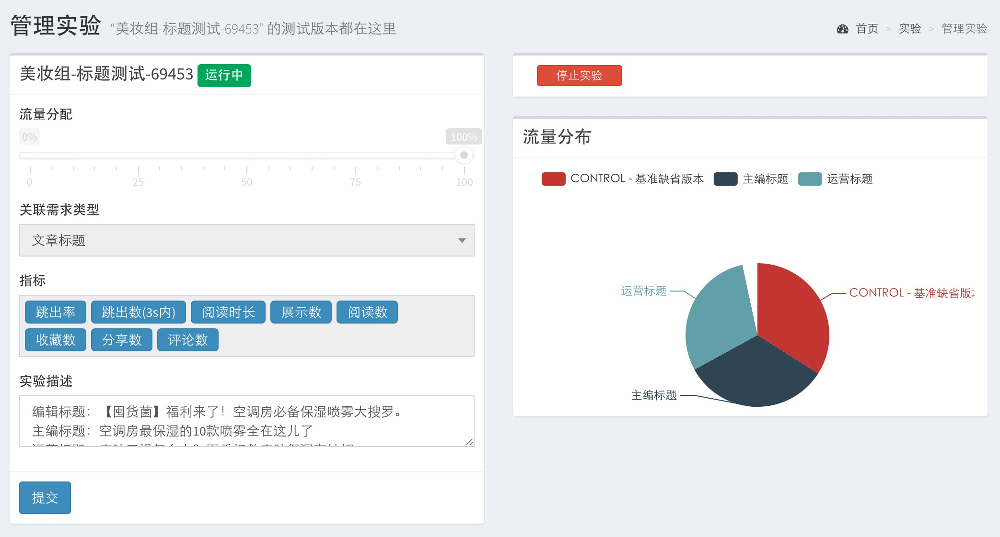
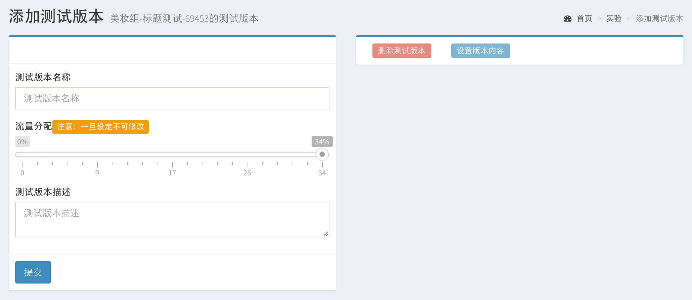

##A/B Test后台
是提供给日常使用者，操作控制A/B Test试验的控制界面

###操作流程

##添加试验
* 目前每个试验流量是按照100%分配的，未来可能会划分独立的流量空间，在此流量空间中进行独立试验。

##试验信息管理
* 只有点击“开始试验”才会进行实际的流量分配，并开始收集试验数据。
* “开始试验”过程较慢需要2~5分钟划分流量
* 实际文章的发布时间是以CMS为最高控制权

##添加试验版本
* 给每个版本划分各自的流量
* 任何未被分配的流量，都会被认为是默认对照Control组的流量

##试验版本

##添加试验版本内容

##查看试验数据图表
* 数据指标是需要提前定义好的
* 提供折线图展示
* 导出CSV文件
* 横轴时间区间缩放
* 保持为图片
* 可以按照时间范围检索数据
