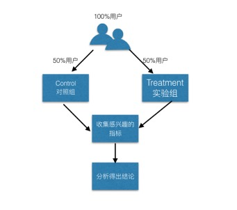
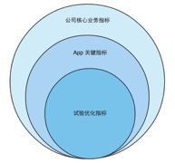

##什么是A/B Test
A/B Test简单来说，就是为同一个目标制定两个方案（A方案和B方案），让一部分用户使用A方案，另一部分用户使用B方案，同时记录下用户的使用情况，看哪个方案更符合设计。

如：

产品或者产品中的元素有两个版本(A和B)，A是现行的设计，B是新的设计。

通过让一部分用户使用方案A，另一部分用户使用方案B，通过观察比较A、B之间你所关心的数据(如:转化率，跳出率，活跃度等)，最后选择效果较优的版本。

A/B Test追踪的是更优的方案，而不是最优。是一种验证性的工具，而非探索性工具。

* 随机切分线上流量到两个或多个不同的版本上，A叫对照组Control，B叫实验组Treatment。
* 通过一定的技术手段收集到你感兴趣的指标。
* 通过对数据的分析，得出结论。

##能干什么
* 用真实的数据代替个人直觉，经验等主观因素的制约。
* 面对多种方案要做艰难抉择时提供参考。
* 最高决策层的决策判断。

##面临什么问题
* 需要有一定的用户量，用户太少没有意义。
* 并不适用于所有的情况，对明显可以直接判断的事情，效率低。
* 被比较的两个变量本身不能是复杂变量，而应当是单一变量。
* 必须先确立判断优劣的决胜因素。
* 数据指标发生变化，有时很难查出原因（如，性能，bug，兼容性等）。
* 新鲜感的问题（新的设计，需要用户慢慢适应。显眼的位置，每个人都会来点击一下）。
* 多重的实验混在一起。
* 只能告诉你现象，并不能直接解释原因。
* 会提高开发复杂度，迭代会被拖慢。发布新版本会等不及实验的结果。

##现在是否是时候
* 产品是否已经基本稳定？A/B Test仅能帮助选择更优方案，不能解决产品的最基本的逻辑是否成立的问题。
* 明显有问题的东西没必要做A/B测试。
* 会对开发速度，技术的复杂度都会造成一定的麻烦。是否做好准备？

##如何评估
* 在线可控对照测试。所有参数和影响都在同步的变化时，只有两件事可以影响最终结果。
	1. Feature的不同(A和B)。
	2. 还有流量分配随机的几率不同。
* 首先需要先确立判断优劣的决胜因素-优化指标

* 先运行A/A测试，评估流量分配的合理性
* 实验组的流量从少开始慢慢增加。（5%，10%，20%，30%，40%，50%...80%，90%）数据呈现统计意义上要比较稳定。

##参考资料

* [大众点评AB测试框架](http://www.csdn.net/article/2015-03-24/2824303)
* [google重叠实验框架](http://www.csdn.net/article/2015-01-09/2823499)
* [移动端AB测试](http://www.docin.com/p-1180392615.html)
* [闪电测试在线发布](http://wenku.it168.com/d_001255104.shtml)
* [facebook与人人网改版](http://www.huxiu.com/article/130729.html)
* [facebook的A/Btest](http://www.huxiu.com/article/132639/1.html)
* [A/BTest数据收集方案](http://blog.csdn.net/weiguang_123/article/details/49203239)
* [绝大多数的 AB 测试终将失败](http://www.oschina.net/translate/most-of-your-abtests-will-fail)
* [阿里UED ABtest方案](http://www.aliued.cn/2010/09/27/ab-testing-realization-method.html)

##参考 ABTest 商业产品
* http://apptimize.com/
* http://www.tune.com/in-app-marketing/
* https://www.leanplum.com/
* http://appiterate.com/